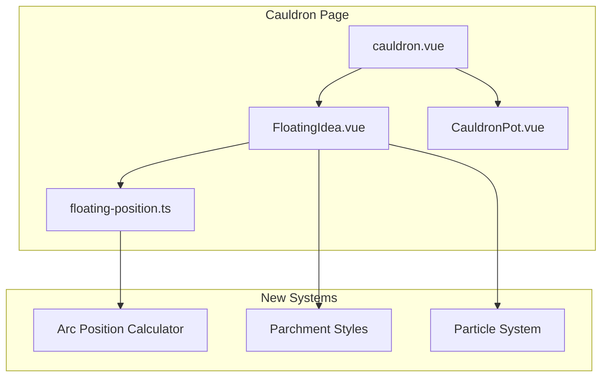

# Design Document: Cauldron Design Rebuild

## Overview

This design transforms the Cauldron page from a clean, grid-based layout into a mystical grimoire-inspired experience. The core changes involve:

1. **Arc Layout System** - Floating ideas positioned in a curved arc above the cauldron
2. **Parchment Aesthetics** - Aged paper textures, torn edges, handwritten fonts
3. **Magical Animations** - Lift, glow, and particle dissolution effects
4. **Organic Clustering** - Ideas feel collected rather than arranged

The implementation modifies `FloatingIdea.vue`, `utils/floating-position.ts`, and `pages/cauldron.vue` while preserving existing functionality.

## Architecture



The architecture maintains the existing component structure while introducing:

- Enhanced position calculation in `floating-position.ts`
- New CSS styles for parchment aesthetics
- Particle animation system for dissolution effects

## Components and Interfaces

### Arc Position Calculator

```typescript
// utils/floating-position.ts

export interface ArcLayoutConfig {
  arcRadius: number // Distance from cauldron center to arc
  arcStartAngle: number // Starting angle in degrees (e.g., -60)
  arcEndAngle: number // Ending angle in degrees (e.g., 60)
  maxCards: number // Maximum cards to display (5)
  cardWidth: number // Card width for overlap calculation
  cardHeight: number // Card height
}

export interface ArcPosition {
  x: number // X coordinate
  y: number // Y coordinate
  rotation: number // Rotation in degrees (-5 to 5 + tangent)
  scale: number // Scale factor for depth effect
}

export function generateArcPosition(
  viewport: ViewportDimensions,
  cardIndex: number,
  totalCards: number,
  config?: Partial<ArcLayoutConfig>
): ArcPosition

export function calculateArcTangentRotation(angle: number): number
```

### Particle System

```typescript
// New: composables/useParticles.ts

export interface Particle {
  id: number
  x: number
  y: number
  targetX: number
  targetY: number
  size: number
  opacity: number
  color: string
}

export interface UseParticlesReturn {
  particles: Ref<Particle[]>
  spawnDissolutionParticles: (
    sourceX: number,
    sourceY: number,
    targetX: number,
    targetY: number,
    count?: number
  ) => void
  updateParticles: () => void
  clearParticles: () => void
}

export function useParticles(): UseParticlesReturn
```

### FloatingIdea Component Updates

```typescript
// components/FloatingIdea.vue - Updated props

interface Props {
  idea: FloatingIdea
  index: number
  totalCards: number // NEW: Total cards for arc calculation
  duration?: number
  isSelected?: boolean
  cauldronCenter?: { x: number; y: number } // NEW: For particle targeting
}

// New emits
emit('dissolveStart', idea) // Triggers particle spawn
```

## Data Models

### Arc Configuration

```typescript
const DEFAULT_ARC_CONFIG: ArcLayoutConfig = {
  arcRadius: 280, // Pixels from cauldron center
  arcStartAngle: -70, // Degrees from vertical
  arcEndAngle: 70, // Degrees from vertical
  maxCards: 5,
  cardWidth: 200,
  cardHeight: 100
}
```

### Parchment Style Variables

```css
:root {
  --parchment-bg: #f4e4bc;
  --parchment-bg-dark: #e8d4a8;
  --parchment-border: #c9b896;
  --parchment-text: #3d3225;
  --parchment-shadow: rgba(61, 50, 37, 0.3);
}
```

## Correctness Properties

_A property is a characteristic or behavior that should hold true across all valid executions of a system-essentially, a formal statement about what the system should do. Properties serve as the bridge between human-readable specifications and machine-verifiable correctness guarantees._

### Property 1: Valid Arc Layout Structure

_For any_ viewport dimensions and card count (1-5), all generated card positions SHALL lie on a valid arc curve above the viewport's vertical center, with the arc centered horizontally on the cauldron position.

**Validates: Requirements 1.1, 4.1**

### Property 2: Even Angular Distribution

_For any_ number of cards N (where N >= 2), the angular spacing between adjacent cards SHALL be equal within a tolerance of 0.1 degrees.

**Validates: Requirements 1.2**

### Property 3: Proportional Spacing Preservation

_For any_ card count less than the maximum, the ratio of used arc span to total arc span SHALL equal the ratio of displayed cards to maximum cards.

**Validates: Requirements 1.3**

### Property 4: Responsive Arc Recalculation

_For any_ viewport resize event, all card positions SHALL be recalculated such that they remain on a valid arc relative to the new viewport center.

**Validates: Requirements 1.4**

### Property 5: Rotation Bounds

_For any_ card in the arc layout, its rotation value SHALL fall within the range of -10 to 10 degrees (base rotation -5 to 5 plus tangent adjustment).

**Validates: Requirements 2.4**

### Property 6: Particle Drift Direction

_For any_ spawned dissolution particle, its position over time SHALL move closer to the cauldron center until reaching the target.

**Validates: Requirements 3.3**

### Property 7: Maximum Display Count

_For any_ set of available floating ideas, the number of ideas displayed in the arc SHALL not exceed 5.

**Validates: Requirements 5.1**

## Error Handling

| Scenario                   | Handling                                                |
| -------------------------- | ------------------------------------------------------- |
| Zero floating ideas        | Display empty cauldron with "gather ingredients" prompt |
| Viewport too small for arc | Fall back to stacked vertical layout                    |
| Particle system overload   | Cap particles at 50, remove oldest first                |
| Invalid arc configuration  | Use DEFAULT_ARC_CONFIG fallback                         |

## Testing Strategy

### Property-Based Testing

The implementation will use **fast-check** for property-based testing in TypeScript/JavaScript.

Each property-based test MUST:

- Run a minimum of 100 iterations
- Be tagged with a comment referencing the correctness property: `**Feature: cauldron-design-rebuild, Property {number}: {property_text}**`
- Generate random but valid inputs (viewport sizes, card counts, positions)

### Unit Testing

Unit tests will cover:

- Arc position calculation edge cases (1 card, 5 cards, viewport boundaries)
- Particle lifecycle (spawn, update, cleanup)
- Rotation calculation accuracy

### Test File Structure

```
utils/
  floating-position.test.ts     # Arc calculation tests
composables/
  useParticles.test.ts          # Particle system tests
```
