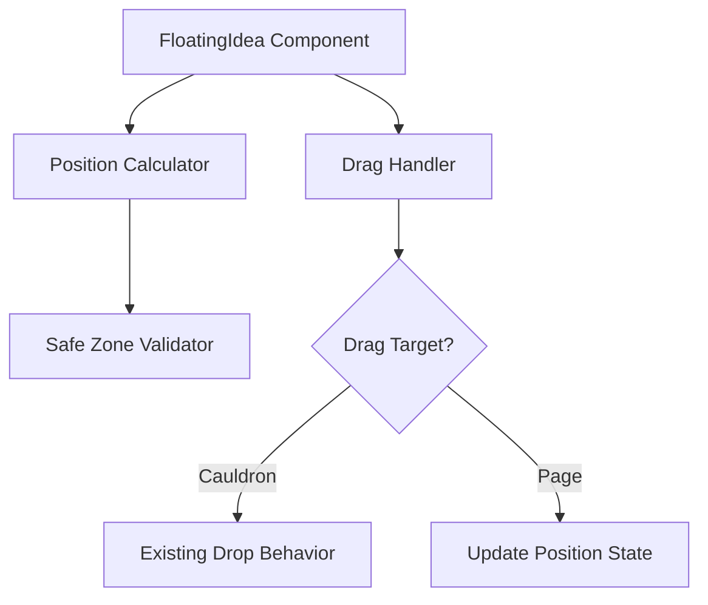

# Design Document: Floating Ideas Positioning

## Overview

This feature enhances the FloatingIdea component to support free repositioning via mouse drag while ensuring initial positions don't obscure important page elements. The implementation modifies the existing drag behavior to distinguish between "drag to reposition" and "drag to cauldron" actions.

## Architecture

The solution extends the existing FloatingIdea component with:

1. Mouse-based drag handling for repositioning (separate from HTML5 drag-and-drop for cauldron)
2. Enhanced position calculation to respect safe zones
3. Visual feedback states for drag interactions



## Components and Interfaces

### FloatingIdea.vue (Modified)

**New State:**

- `isRepositioning: boolean` - Tracks if user is repositioning the card
- `dragOffset: { x: number, y: number }` - Offset from cursor to card corner during drag

**Modified Behavior:**

- Use `mousedown/mousemove/mouseup` for repositioning instead of HTML5 drag
- Keep HTML5 `dragstart` only for cauldron drop detection
- Pause drift animation when `isRepositioning` is true

**New Methods:**

- `handleMouseDown(event: MouseEvent)` - Start repositioning, calculate offset
- `handleMouseMove(event: MouseEvent)` - Update position during drag
- `handleMouseUp()` - End repositioning, persist position

### Position Calculator (getRandomEdgePosition)

**Enhanced Logic:**

- Define safe zones as rectangles/circles to avoid
- Attempt positioning with collision detection
- Fallback to edge positions if no valid position found

**Safe Zones:**

- Cauldron: Circle with 350px radius from viewport center
- Navigation: Rectangle at top (0 to 120px height)
- Input area: Rectangle at bottom center (300px width, 200px height from bottom)

## Data Models

```typescript
interface Position {
  x: number
  y: number
}

interface SafeZone {
  type: 'circle' | 'rectangle'
  // For circle
  centerX?: number
  centerY?: number
  radius?: number
  // For rectangle
  left?: number
  top?: number
  width?: number
  height?: number
}

interface CardBounds {
  x: number
  y: number
  width: number
  height: number
}
```

## Correctness Properties

_A property is a characteristic or behavior that should hold true across all valid executions of a system-essentially, a formal statement about what the system should do. Properties serve as the bridge between human-readable specifications and machine-verifiable correctness guarantees._

### Property 1: Safe Zone Avoidance

_For any_ generated initial position and viewport dimensions, the position SHALL place the card entirely outside all defined safe zones (cauldron center 350px radius, navigation top 120px, input area bottom 200px).

**Validates: Requirements 1.1, 1.2, 1.3**

### Property 2: Card Spacing Maintained

_For any_ set of generated card positions, no two cards SHALL have their bounding boxes overlap when accounting for 40px padding.

**Validates: Requirements 1.4**

## Error Handling

| Scenario                                   | Handling                                            |
| ------------------------------------------ | --------------------------------------------------- |
| No valid position found after max attempts | Use fallback edge position with best-effort spacing |
| Drag outside viewport                      | Clamp position to viewport bounds                   |
| Rapid drag events                          | Throttle position updates to 60fps                  |

## Testing Strategy

### Property-Based Testing

Use `fast-check` for property-based testing of position generation:

1. **Safe Zone Property Test**: Generate random viewport dimensions and card indices, verify all positions avoid safe zones
2. **Spacing Property Test**: Generate multiple card positions, verify minimum spacing maintained

Each property test should run minimum 100 iterations.

### Unit Tests

- Test `isInsideSafeZone()` helper with known coordinates
- Test position clamping at viewport boundaries
- Test drag offset calculation

### Integration Tests

- Verify drag-to-reposition updates card position
- Verify drag-to-cauldron still triggers ingredient addition
- Verify animation pause during drag
